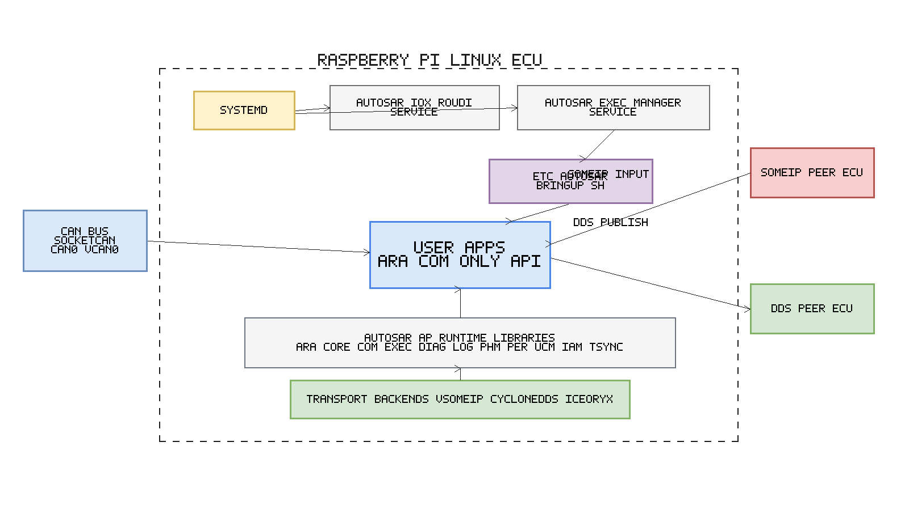

# Adaptive-AUTOSAR Documentation Hub

This is the central documentation index for the Adaptive-AUTOSAR project.
For the project overview, see the [root README](../README.md).

Language: [日本語](README.ja.md)

---

## Quick Navigation

| I want to... | Go to |
| --- | --- |
| Build and run for the first time | [Quick Start](../README.md#quick-start-build---install---user-app-buildrun) |
| Deploy on Raspberry Pi ECU | [RPi ECU Guide](../deployment/rpi_ecu/README.md) |
| Cross-compile for QNX 8.0 | [QNX Guide](../qnx/README.md) |
| Write my own AUTOSAR app | [User Apps](../user_apps/README.md) |
| Learn step by step (tutorials) | [Tutorials Index](../user_apps/tutorials/README.md) |
| Generate ARXML / C++ bindings | [ARXML Generator](../tools/arxml_generator/README.md) |
| Test diagnostics from a host PC | [DoIP Tester](../tools/host_tools/doip_diag_tester/README.md) |
| Browse the API reference | [API Docs (online)](https://tatsuyai713.github.io/Adaptive-AUTOSAR/) |

---

## All Documentation Files

| File | Lang | Description |
| --- | :---: | --- |
| [README.md](../README.md) | EN | Project overview, Quick Start, Feature Matrix |
| [README.ja.md](../README.ja.md) | JA | Project overview (Japanese) |
| [CONTRIBUTING.md](../CONTRIBUTING.md) | EN | Contribution guidelines |
| [CODE_OF_CONDUCT.md](../CODE_OF_CONDUCT.md) | EN | Community code of conduct |
| **docs/** | | |
| [docs/README.md](README.md) | EN | Documentation hub (this file) |
| [docs/README.ja.md](README.ja.md) | JA | Documentation hub (Japanese) |
| **user_apps/** | | |
| [user_apps/README.md](../user_apps/README.md) | EN | User app build system and app targets |
| [user_apps/tutorials/README.md](../user_apps/tutorials/README.md) | EN | Tutorial index |
| [user_apps/tutorials/README.ja.md](../user_apps/tutorials/README.ja.md) | JA | Tutorial index (Japanese) |
| **deployment/** | | |
| [deployment/rpi_ecu/README.md](../deployment/rpi_ecu/README.md) | EN | Raspberry Pi ECU deployment runbook |
| [deployment/rpi_ecu/RASPI_SETUP_MANUAL.ja.md](../deployment/rpi_ecu/RASPI_SETUP_MANUAL.ja.md) | JA | RPi gPTP/PTP detailed setup (Japanese) |
| **qnx/** | | |
| [qnx/README.md](../qnx/README.md) | JA | QNX 8.0 cross-compilation guide |
| **tools/** | | |
| [tools/arxml_generator/README.md](../tools/arxml_generator/README.md) | EN | ARXML generator guide |
| [tools/arxml_generator/YAML_MANUAL.ja.md](../tools/arxml_generator/YAML_MANUAL.ja.md) | JA | YAML specification (Japanese) |
| [tools/host_tools/doip_diag_tester/README.md](../tools/host_tools/doip_diag_tester/README.md) | EN | Host-side DoIP/UDS diagnostic tester |
| [tools/host_tools/doip_diag_tester/README.ja.md](../tools/host_tools/doip_diag_tester/README.ja.md) | JA | DoIP tester guide (Japanese) |

---

## Tutorials (Step-by-Step)

All tutorials are located under [`user_apps/tutorials/`](../user_apps/tutorials/).
See [tutorials/README.md](../user_apps/tutorials/README.md) for the full index.

| # | Topic | File |
| --- | --- | --- |
| 01 | Runtime init/deinit lifecycle | [01_runtime_lifecycle.ja.md](../user_apps/tutorials/01_runtime_lifecycle.ja.md) |
| 02 | Execution and signal handling | [02_exec_signal.ja.md](../user_apps/tutorials/02_exec_signal.ja.md) |
| 03 | Persistency and health monitoring | [03_per_phm.ja.md](../user_apps/tutorials/03_per_phm.ja.md) |
| 04 | SOME/IP pub/sub communication | [04_someip_pubsub.ja.md](../user_apps/tutorials/04_someip_pubsub.ja.md) |
| 05 | Zero-copy IPC (iceoryx) | [05_zerocopy_pubsub.ja.md](../user_apps/tutorials/05_zerocopy_pubsub.ja.md) |
| 06 | DDS pub/sub (CycloneDDS) | [06_dds_pubsub.ja.md](../user_apps/tutorials/06_dds_pubsub.ja.md) |
| 07 | SocketCAN message decoding | [07_socketcan_decode.ja.md](../user_apps/tutorials/07_socketcan_decode.ja.md) |
| 08 | Full ECU stack implementation | [08_ecu_full_stack.ja.md](../user_apps/tutorials/08_ecu_full_stack.ja.md) |
| 09 | Raspberry Pi ECU deployment | [09_rpi_ecu_deployment.ja.md](../user_apps/tutorials/09_rpi_ecu_deployment.ja.md) |
| 10 | Porting from Vector/ETAS/EB assets | [10_vendor_autosar_asset_porting.ja.md](../user_apps/tutorials/10_vendor_autosar_asset_porting.ja.md) |

---

## Project Layout

```text
Adaptive-AUTOSAR/
├── src/                    # Core AUTOSAR AP implementation
│   ├── ara/                # AUTOSAR Adaptive Platform APIs
│   │   ├── core/           # Foundation types (Result, Optional, Future, ...)
│   │   ├── com/            # Communication (SOME/IP, DDS, ZeroCopy, E2E, SecOC)
│   │   ├── log/            # Logging framework (console / file / network / DLT)
│   │   ├── exec/           # Execution management
│   │   ├── diag/           # Diagnostics (UDS services, DoIP)
│   │   ├── phm/            # Platform Health Management
│   │   ├── per/            # Persistency (key-value / file storage)
│   │   ├── sm/             # State Management
│   │   ├── tsync/          # Time Synchronization (NTP / PTP)
│   │   ├── ucm/            # Update & Configuration Management
│   │   ├── iam/            # Identity & Access Management
│   │   ├── crypto/         # Cryptography (SHA, HMAC, AES, RSA, ECDSA)
│   │   ├── nm/             # Network Management
│   │   └── secoc/          # Secure Onboard Communication
│   ├── application/        # Platform-side daemons and helpers
│   └── arxml/              # ARXML schema parsing library
│
├── test/                   # Unit tests (mirrors src/ structure)
│
├── user_apps/              # User application templates and tutorials
│   ├── src/apps/
│   │   ├── basic/          # Minimal runtime, signal handling, PER/PHM demo
│   │   ├── communication/  # SOME/IP, DDS, ZeroCopy pub/sub templates
│   │   └── feature/        # Runtime lifecycle, SocketCAN, full ECU stack
│   ├── src/features/       # Shared feature modules used by advanced apps
│   ├── idl/                # DDS IDL definitions (CycloneDDS)
│   └── tutorials/          # Step-by-step tutorials 01-10
│
├── scripts/                # Linux build, install, and deployment scripts
│   ├── install_dependency.sh
│   ├── install_middleware_stack.sh   # vSomeIP + iceoryx + CycloneDDS
│   ├── build_and_install_autosar_ap.sh
│   ├── build_user_apps_from_opt.sh
│   ├── build_and_install_rpi_ecu_profile.sh
│   ├── install_rpi_ecu_services.sh
│   ├── setup_socketcan_interface.sh
│   ├── verify_rpi_ecu_profile.sh
│   └── generate_doxygen_docs.sh
│
├── qnx/                    # QNX SDP 8.0 cross-compilation support
│   ├── cmake/              # QNX toolchain file (toolchain_qnx800.cmake)
│   ├── env/                # QNX environment variable templates
│   ├── patches/            # Source-level compatibility patches (Python)
│   └── scripts/            # QNX cross-build scripts
│       ├── build_all_qnx.sh
│       ├── build_libraries_qnx.sh
│       ├── build_autosar_ap_qnx.sh
│       ├── build_user_apps_qnx.sh
│       ├── create_qnx_deploy_image.sh
│       └── deploy_to_qnx_target.sh
│
├── tools/                  # Development and diagnostic tools
│   ├── arxml_generator/    # YAML -> ARXML -> C++ binding code generation
│   ├── host_tools/
│   │   └── doip_diag_tester/   # Host-side DoIP/UDS diagnostic tester
│   └── sample_runner/      # Communication transport verification scripts
│
├── deployment/             # Deployment profiles and runtime configuration
│   └── rpi_ecu/            # Raspberry Pi prototype ECU profile
│       ├── systemd/        # 17 systemd service unit files
│       ├── bin/            # Per-service wrapper shell scripts
│       ├── env/            # Per-service environment variable templates
│       └── bringup/        # User app launcher script template
│
├── configuration/          # ARXML manifests and vSomeIP JSON configs
├── cmake/                  # CMake package configuration template
├── docs/                   # Documentation hub + Doxygen output
│   ├── README.md           # This file (documentation index)
│   ├── README.ja.md        # Documentation index (Japanese)
│   ├── doxygen.conf        # Doxygen configuration
│   ├── api/                # Generated API docs (after running doxygen)
│   └── simulation_flow_diagram.png
│
├── .github/workflows/      # CI/CD (GitHub Actions)
├── CMakeLists.txt          # Main build configuration
├── README.md               # Project overview (English)
└── README.ja.md            # Project overview (Japanese)
```

---

## Scripts Reference

### Linux Build & Deployment (`scripts/`)

| Script | Purpose |
| --- | --- |
| `install_dependency.sh` | Install system-level build dependencies |
| `install_middleware_stack.sh` | Build and install vSomeIP, iceoryx, CycloneDDS |
| `install_vsomeip.sh` | Install vSomeIP only |
| `install_iceoryx.sh` | Install iceoryx only |
| `install_cyclonedds.sh` | Install CycloneDDS only |
| `build_and_install_autosar_ap.sh` | Build AUTOSAR AP runtime and install |
| `build_user_apps_from_opt.sh` | Build user apps against installed runtime |
| `build_and_install_rpi_ecu_profile.sh` | Full Raspberry Pi ECU build + install |
| `install_rpi_ecu_services.sh` | Install and enable systemd services |
| `setup_socketcan_interface.sh` | Configure SocketCAN interface |
| `verify_rpi_ecu_profile.sh` | Verify ECU profile health |
| `generate_doxygen_docs.sh` | Generate Doxygen API documentation |

### QNX Cross-Build (`qnx/scripts/`)

| Script | Purpose |
| --- | --- |
| `build_all_qnx.sh` | Master build: middleware + runtime + user apps |
| `build_libraries_qnx.sh` | Cross-build all middleware libraries |
| `build_boost_qnx.sh` | Cross-build Boost (static) |
| `build_vsomeip_qnx.sh` | Cross-build vSomeIP |
| `build_cyclonedds_qnx.sh` | Cross-build CycloneDDS |
| `build_iceoryx_qnx.sh` | Cross-build iceoryx |
| `build_autosar_ap_qnx.sh` | Cross-build AUTOSAR AP runtime |
| `build_user_apps_qnx.sh` | Cross-build user applications |
| `build_host_tools.sh` | Build host-side tools |
| `create_qnx_deploy_image.sh` | Create deployment image (tar.gz / IFS) |
| `deploy_to_qnx_target.sh` | Deploy to QNX target via SSH |
| `install_dependency.sh` | Verify QNX host tool prerequisites |

### Verification Scripts (`tools/sample_runner/`)

| Script | What it verifies |
| --- | --- |
| `verify_ara_com_someip_transport.sh` | SOME/IP pub/sub communication |
| `verify_ara_com_dds_transport.sh` | DDS pub/sub communication |
| `verify_ara_com_zerocopy_transport.sh` | Zero-copy IPC communication |
| `verify_ara_com_async_bsd_transport.sh` | Async BSD socket transport |
| `verify_ecu_can_to_dds.sh` | CAN to DDS gateway |
| `verify_ecu_reference_gateway.sh` | Full reference gateway |
| `verify_ecu_someip_dds.sh` | SOME/IP to DDS bridge |

---

## Architecture Diagram



Source: `docs/simulation_flow_diagram.drawio` (editable with [draw.io](https://draw.io))

---

## API Reference (Doxygen)

- **Online**: <https://tatsuyai713.github.io/Adaptive-AUTOSAR/>
- **Local generation**:

  ```bash
  ./scripts/generate_doxygen_docs.sh
  ```

- **Output**: `docs/api/index.html` (after generation)
- **Config**: `docs/doxygen.conf`
